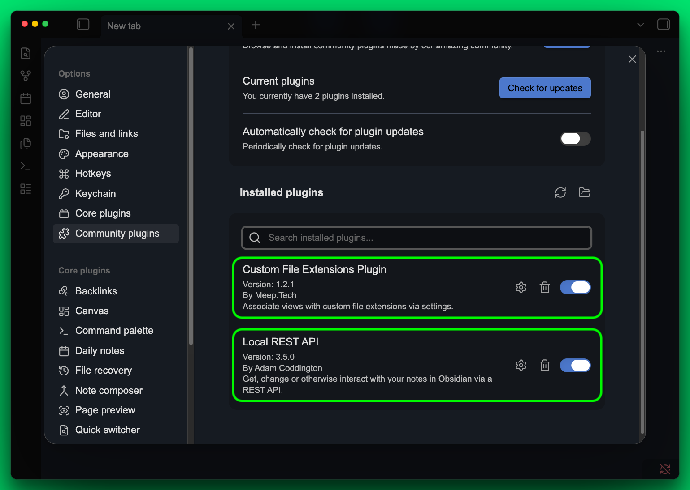
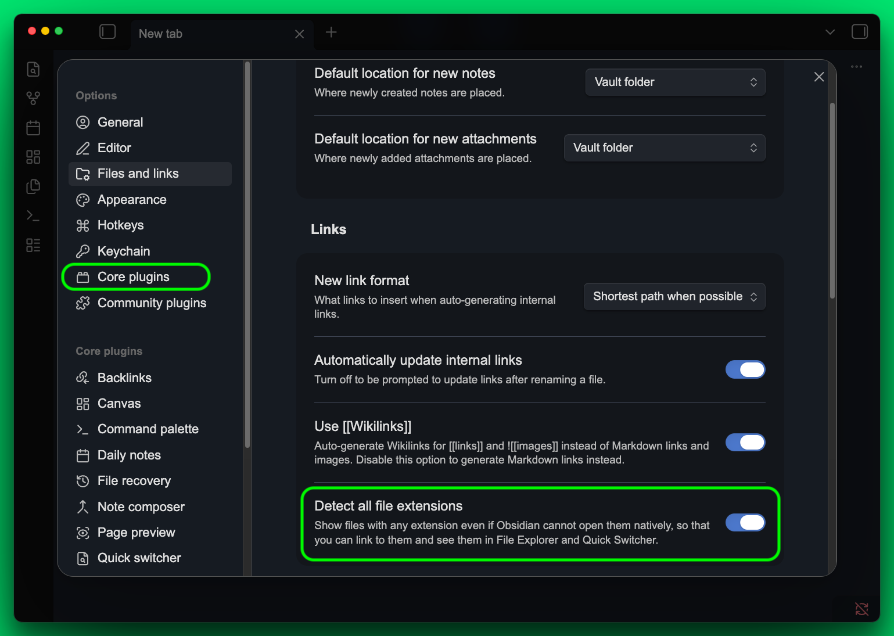

# obsidian-claude

<p align="center">
  <strong>Make Claude Code and Obsidian work together on macOS.</strong>
</p>

<p align="center">
  <a href="https://opensource.org/licenses/MIT"></a>
  
  
  
</p>

<p align="center">
  <a href="#the-problem">Problem</a> ·
  <a href="#the-fix">Fix</a> ·
  <a href="#setup">Setup</a> ·
  <a href="#how-it-works">How It Works</a> ·
  <a href="#troubleshooting">Troubleshooting</a> ·
  <a href="#uninstall">Uninstall</a> ·
  <a href="https://docs.augent.app/guides/obsidian-setup">Docs</a>
</p>

---

## The Problem

When Claude Code edits a file inside an Obsidian vault, Obsidian's in-memory cache detects the disk change and silently reverts it within 1-2 seconds. Claude reads back stale content. Edits appear to succeed but are lost.

This is not a bug in Claude or Obsidian. It is a timing conflict between two programs writing to the same file.

## The Fix

This repo provides a battle-tested solution: a Claude Code hook that intercepts every Edit and Write operation, detects vault files, and syncs changes through Obsidian's Local REST API instead of relying on disk writes alone. Plus two lightweight macOS apps that make every `.txt` and `.md` file on your Mac open directly in Obsidian.

## Security and Privacy

> **Everything runs locally. Nothing leaves your machine.**
>
> - No network requests leave localhost. Zero telemetry, zero analytics, zero tracking.
> - The REST API runs on `localhost:27124` with a local-only API key generated by the Obsidian plugin.
> - All source code is in this repository. The setup script compiles from source on your machine.
> - The hook only activates for files inside an Obsidian vault. Non-vault files have zero overhead.
> - You can and should read `setup.sh` before running it. It is written to be auditable.
> - Full uninstall available — `bash uninstall.sh` cleanly removes everything.

## What Gets Installed

| Component | Purpose | Location |
|---|---|---|
| PostToolUse hook | Syncs Claude's edits through Obsidian's REST API | `~/.claude/hooks/obsidian-post-edit.sh` |
| PreToolUse hook | Navigates Obsidian away before edits to reduce cache conflicts | `~/.claude/hooks/obsidian-pre-edit.sh` |
| Open in Obsidian.app | Default macOS handler for `.txt` and `.md` files | `/Applications/` |
| Obsidian File Watcher.app | Re-links external files when hard links break | `/Applications/` |
| Hook config | Registers hooks with Claude Code | `~/.claude/settings.json` (additive) |
| duti config | Sets default file handler | System preference (via duti) |

## Prerequisites

- macOS (Apple Silicon or Intel)
- [Obsidian](https://obsidian.md) installed with at least one vault
- [Claude Code](https://claude.ai/code) installed
- Xcode Command Line Tools: `xcode-select --install`

## Setup

### Part 1: Configure Obsidian (2 minutes, manual)

Do this **before** running the setup script.

1. Open Obsidian Settings (gear icon) > **Community plugins** > Turn on community plugins.
2. Install and enable **Custom File Extensions** by MeepTech.
   `obsidian://show-plugin?id=obsidian-custom-file-extensions-plugin`
3. Install and enable **Local REST API** by Adam Coddington.
   `obsidian://show-plugin?id=obsidian-local-rest-api`

Both plugins should be installed and toggled ON:

<p align="center">
  
</p>

4. Go to Settings > **Files and links** > toggle **Detect all file extensions** ON.

<p align="center">
  
</p>

5. Restart Obsidian (quit fully and reopen).

### Part 2: Run the setup script

**Option A: Clone and run (recommended)**

```bash
git clone https://github.com/AugentDevs/obsidian-claude.git
cd obsidian-claude
bash setup.sh
```

**Option B: One-liner**

```bash
bash <(curl -fsSL https://raw.githubusercontent.com/AugentDevs/obsidian-claude/main/setup.sh)
```

The script will:

- Detect your vault path automatically
- Verify the Obsidian plugins are installed and running
- Compile two macOS apps from source (Swift)
- Register them as default file handlers
- Install the Claude Code hooks
- Verify everything works

After setup, restart Claude Code (`/exit` and relaunch) for the hooks to take effect.

## How It Works

### The race condition

```
Claude Edit → writes to disk → Obsidian detects change → reverts to in-memory cache → edit lost
```

### The fix

```
Claude Edit → writes to disk → hook fires → waits 2s for Obsidian revert →
  Edit: GETs current content from REST API, applies old→new replacement, PUTs result
  Write: sends full content directly via REST API PUT
→ Obsidian updates in-memory state + flushes to disk → Claude reads correct content
```

The hook is synchronous -- it blocks for ~2.5 seconds per vault edit so Claude always reads the correct file on the next operation. Non-vault files exit instantly with zero overhead.

### The apps

**Open in Obsidian** -- A native Swift binary that receives Apple Events when you double-click a `.txt` or `.md` file. Files inside the vault open directly. Files outside the vault are hard-linked into an `External Files/` folder so Obsidian can index them. Falls back to symlinks for cross-volume files.

**Obsidian File Watcher** -- A background app that monitors the hard-link map every 2 seconds. When an external editor does an atomic write (creating a new inode), the hard link breaks. The watcher detects the mismatch and re-creates the link so Obsidian sees the updated content.

## Troubleshooting

| Problem | Fix |
|---|---|
| Edits still revert after setup | Restart Claude Code. Verify REST API plugin is enabled. Check `curl -s --insecure https://localhost:27124` returns JSON. |
| Hook doesn't fire | Check `~/.claude/settings.json` has the obsidian hook entries. Hooks load on startup -- restart Claude Code. |
| `duti -x txt` still shows TextEdit | Re-run: `bash setup.sh` (safe to run multiple times). |
| swiftc fails | Run `sudo xcode-select --reset` then re-run setup. |
| Permission dialogs on Desktop/Documents | Click Allow. Both Obsidian and the apps may need filesystem access. |

## Uninstall

```bash
bash uninstall.sh
```

Or without cloning:

```bash
bash <(curl -fsSL https://raw.githubusercontent.com/AugentDevs/obsidian-claude/main/uninstall.sh)
```

**This removes:**

- Both apps from `/Applications/`
- Hook scripts from `~/.claude/hooks/`
- Hook entries from `~/.claude/settings.json`
- File handler registrations (restores TextEdit for `.txt`, Obsidian for `.md`)
- File Watcher from login items

**This does NOT touch:**

- Your Obsidian vault or any files in it
- Your Obsidian plugins or settings
- Homebrew or duti

## Used with Augent

This setup is part of the [Augent](https://github.com/AugentDevs/Augent) ecosystem -- an audio intelligence engine for Claude Code. Augent's `take_notes` tool saves rich notes as `.txt` files styled for Obsidian. This setup ensures those files open correctly and that Claude can edit them without conflicts.

You don't need Augent to use this repo. It works with any Obsidian vault.

## License

MIT License. See [LICENSE](LICENSE).
